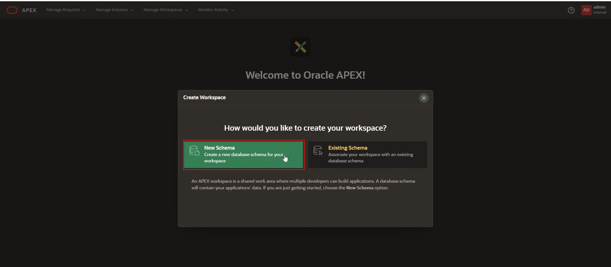
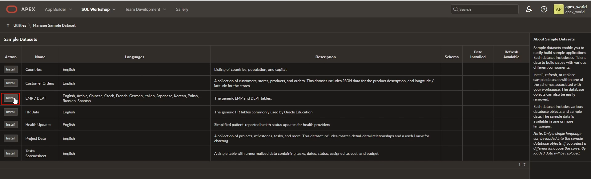
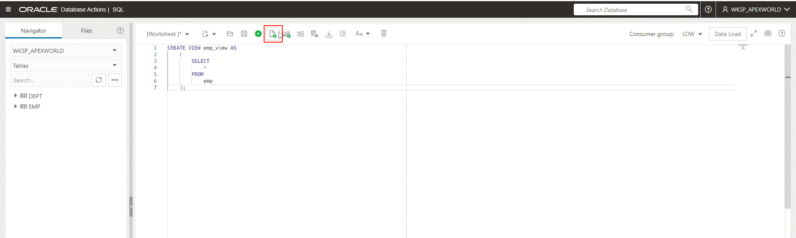
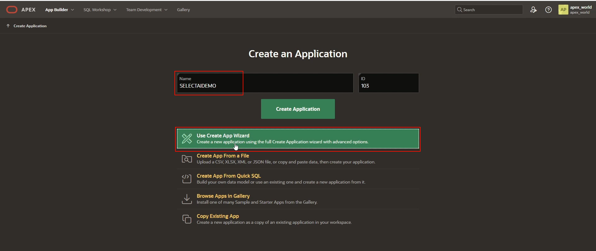
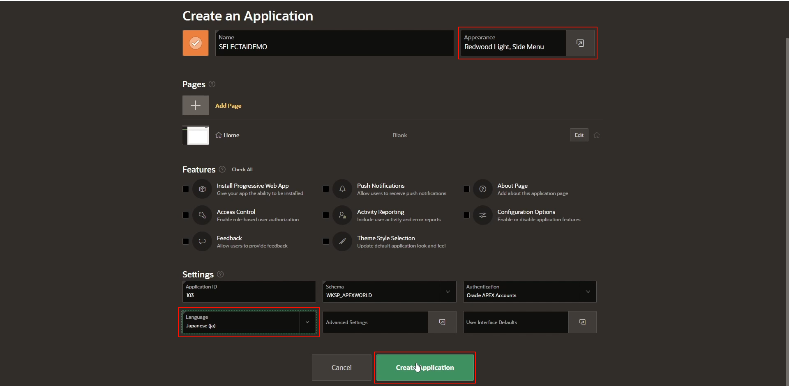
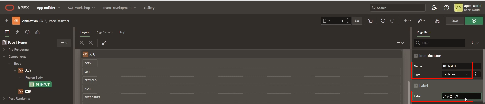
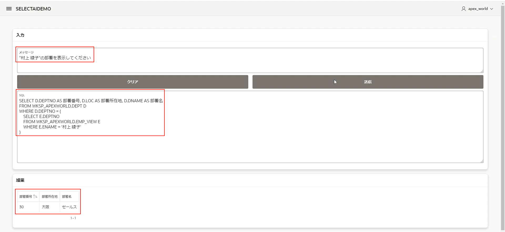

# Oracle SELECT AI with APEX Hands on LAB

<p align="right">Next-generation application development using generative AI</p>

The app developed with OCI Autonomous Database's APEX leverages the features of SELECT AI and VPD (Virtual Private Database) to enable natural language data searches and permission-based control of search results. This article explains the steps to quickly create such an application.

> This is not a study material for APEX, Select AI, and VPD, so it does not include detailed explanations of each function.

 

## 0. Prerequisites

- OCI Autonomous Database creation complete

- Obtaining the OpenAI API Key is complete ( please refer to [the OpenAI quick start for how to obtain it)](https://platform.openai.com/docs/quickstart)

   

## 1. Create APEX Workspace

Create an APEX Workspace.

 

On the Autonomous Database details screen, click the instance name (for example) under the APEX instance .`apexselectai`


On the APEX instance details screen, click "Launch APEX".


`ADMIN`Enter the user's password and click "Sign In to Administration".


Click "Create Workspace".


Click "New Schema".



Enter the following items and click "Create Workspace".

- Workspace Name:`APEX_WORLD`
- Workspace Username:`APEX_WORLD`
- Workspace Password:`<YOUR_PASSWORD>`
- Database Password:`<YOUR_PASSWORD>`


 

## 2. User verification

Once created, `ADMIN`"Sign out" the user to validate the newly created user.

 

`ADMIN`Click on the user and click "Sign out".


Click "Return to Sign In Page".


"Sign In" with the newly created user.`APEX_WORLD`

Enter the following items and click "Sign In".

- Workspace:`APEX_WORLD`
- Database Username:`APEX_WORLD`
- Password:`<YOUR_PASSWORD>`


We have verified that newly created users can "Sign In" without any problems.`APEX_WORLD`


The APEX application schema and schema user were also created at the same time for the newly created Workspace.

The names of the schemas and schema users for APEX applications are prefixed with `APEX_WORLD`a .`_``WKSP_``WKSP_APEXWORLD`

 

The APEX Workspace creation is now complete.

 

## 3. Grant privileges to schema users

Grant privileges to schema users for APEX applications.

 

On the Autonomous Database details screen, select the database action and click "SQL".


Paste the SQL statement below and click "Run Script (F5)".

```
GRANT console_developer TO wksp_apexworld;

GRANT dwrole TO wksp_apexworld;

GRANT resource TO wksp_apexworld;

GRANT EXECUTE ON dbms_cloud_ai TO wksp_apexworld;

GRANT EXECUTE ON dbms_rls TO wksp_apexworld;

GRANT EXECUTE ON dbms_session TO wksp_apexworld;
/

BEGIN
    ords.enable_schema(p_enabled => TRUE, p_schema => 'WKSP_APEXWORLD', p_url_mapping_type => 'BASE_PATH', p_url_mapping_pattern => 'WKSP_APEXWORLD'
    , p_auto_rest_auth => TRUE);

    COMMIT;
END;
/
```

You will also need settings to access OpenAI's API Endpoint.

```
BEGIN
    dbms_network_acl_admin.append_host_ace(host => 'api.openai.com', lower_port => 443, upper_port => 443, ace => xs$ace_type(privilege_list => xs$name_list
    ('http'), principal_name => 'WKSP_APEXWORLD', principal_type => xs_acl.ptype_db));
END;
/
```

 

You have now granted privileges to the schema user for your APEX application.

 

## 4. Installing sample datasets

Install the sample dataset.

 

`APEX_WORLD`On the APEX Workspace screen where the user "Signs In", select "SQL Workshop" => "Utilities" => "Sample Datasets".


We will install the sample dataset of "EMP/DEPT", so click "Install" with "Name" of "EMP/DEPT".



Select "Japanese" for "Language" and click "Next".


On the next screen, click "Install Dataset".


Finally, click "Exit".


Also, the DDL to create the "DEPT" and "EMP" tables is the following SQL statement. Please refer to it.

```
CREATE TABLE "DEPT" 
 (	"DEPTNO" NUMBER(4,0) GENERATED BY DEFAULT ON NULL AS IDENTITY MINVALUE 1 MAXVALUE 9000 INCREMENT BY 10 START WITH 50 NOCACHE  NOORDER  NOCYCLE  NOKEEP  NOSCALE  NOT NULL ENABLE, 
	"DNAME" VARCHAR2(50), 
	"LOC" VARCHAR2(50), 
	 CONSTRAINT "DEPT_PK" PRIMARY KEY ("DEPTNO")
USING INDEX  ENABLE
 ) ;
 
CREATE TABLE "EMP" 
 (	"EMPNO" NUMBER(4,0) GENERATED BY DEFAULT ON NULL AS IDENTITY MINVALUE 1 MAXVALUE 90000 INCREMENT BY 10 START WITH 8000 NOCACHE  NOORDER  NOCYCLE  NOKEEP  NOSCALE  NOT NULL ENABLE, 
	"ENAME" VARCHAR2(50), 
	"JOB" VARCHAR2(50), 
	"MGR" NUMBER(4,0), 
	"HIREDATE" DATE, 
	"SAL" NUMBER(7,2), 
	"COMM" NUMBER(7,2), 
	"DEPTNO" NUMBER(4,0), 
	 CONSTRAINT "EMP_PK" PRIMARY KEY ("EMPNO")
USING INDEX  ENABLE
 ) ;

ALTER TABLE "EMP" ADD CONSTRAINT "EMP_MGR_FK" FOREIGN KEY ("MGR")
	  REFERENCES "EMP" ("EMPNO") ENABLE;
ALTER TABLE "EMP" ADD CONSTRAINT "EMP_DEPT_FK" FOREIGN KEY ("DEPTNO")
	  REFERENCES "DEPT" ("DEPTNO") ENABLE;

CREATE INDEX "EMP_1" ON "EMP" ("MGR");

CREATE INDEX "EMP_2" ON "EMP" ("DEPTNO");
```

 

The installation of the sample dataset is now complete.

 

## 5. Add comments, create views and create profiles

Add comments for each table and column. Also create a view of the EMP table (*).

Also, create a profile to access OpenAI.

> *EMP table view is required when using VPD ( [Virtual Private Database to Control Data Access ).](https://docs.oracle.com/en/database/oracle/oracle-database/19/dbseg/using-oracle-vpd-to-control-data-access.html)

 

`APEX_WORLD`On the APEX Workspace screen where the user "Signs In", select "SQL Workshop" => "SQL Developer Web".


Paste the SQL statement below and click "Run Script (F5)".

```
COMMENT ON TABLE emp IS
    'Includes employee number, name, job title, supervisor number, date of employment, salary, and department number';
COMMENT ON COLUMN emp.empno IS
    'employee number';
COMMENT ON COLUMN emp.ename IS
    'Employee name';
COMMENT ON COLUMN emp.job IS
    'Job type';
COMMENT ON COLUMN emp.mgr IS
    'Boss number';
COMMENT ON COLUMN emp.hiredate IS
    'hire date';
COMMENT ON COLUMN emp.sal IS
    'salary';
COMMENT ON COLUMN emp.comm IS
    'commission';
COMMENT ON COLUMN emp.deptno IS
    'Department number (used to join with DEPT table)';
COMMENT ON TABLE dept IS
    'Includes department number, department name, and department location';
COMMENT ON COLUMN dept.deptno IS
    'Department number';
COMMENT ON COLUMN dept.dname IS
    'Department name';
COMMENT ON COLUMN dept.loc IS
    'Department location';
    
CREATE VIEW emp_view AS
    (
        SELECT
            *
        FROM
            emp
    );
    
    
EXEC DBMS_CLOUD.create_credential('OPENAI_CRED', 'openai', 'OPENAI_API_KEY: https://platform.openai.com/docs/quickstart');

BEGIN
    dbms_cloud_ai.drop_profile(profile_name => 'OPENAI', force => TRUE);
    dbms_cloud_ai.create_profile(profile_name => 'OPENAI', attributes => '{"provider": "openai",
          "credential_name": "OPENAI_CRED",
          "comments":"true",
          "temperature":0.0,
          "model":"gpt-3.5-turbo",
          "object_list": [
            {"owner": "WKSP_APEXWORLD", "name": "EMP_VIEW"},
          {"owner": "WKSP_APEXWORLD", "name": "DEPT"}
          ]
        }');
    dbms_cloud_ai.set_profile(profile_name => 'OPENAI');
    dbms_cloud_ai.enable_profile(profile_name => 'OPENAI');
END;
/
```





Let's verify with the following SQL statement.

```
SELECT
    dbms_cloud_ai.generate(prompt => 'Hello', profile_name => 'OPENAI', action => 'CHAT')
FROM
    dual;
```

If you receive a response from OpenAI, the verification was successful.


 

You have now finished adding comments, creating views, and creating profiles.

 

## 6. Creating an APEX application

Create an APEX application.

 

`APEX_WORLD`On the APEX Workspace screen where the user "Signs In", select "App Builder" => "Create".


Enter a name (e.g. ) in "Name" and click "Use Create App Wizard".`SELECTAIDEMO`



Select "Redwood Light, Side Menu" for "Appearance", select "Japanese (ja)" for "Language", and click "Create Application".



Click "1 - Home".


Delete the existing "Breadcrumb Bar".

Right-click on "SELECTAIDEMO" and select "Delete".


Create two Regions.

Right-click "Body" and click "Create Region".


Enter "Input" in the "Title" of the first Region.


Enter "Result" in the "Title" of the second Region.


Create one "Textarea", two "Buttons", and one "Textarea" for the "input" Region.

Right-click the "Input" Region and click "Create Page Item".


Configure the first "Textarea" as follows.

- "Name": "P1_INPUT"
- "Type": "Textarea"
- "Label": "Message"
- "Height": "3"




Next, right-click "Region Body" and click "Create Button".


Configure the first "Button" as follows.

- "Button Name": "Clear"
- "Label": "Clear"


Configure the second "Button" as follows.

- "Button Name": "Submit"
- "Label": "Send"
- "Start New Row": Off


Create one more "Textarea" and configure it as follows.

- "Name": "P1_SQL"
- "Type": "Textarea"
- "Label": "SQL"
- "Height": "12"


Perform the save process.

Click "Save" in the upper right corner. (I will omit the explanation of the saving process from here on.)

> We recommend that you save each time you make changes.


Create one "Table" for the "result" Region.

Right-click the "Results" Region and click "Create Sub Region".


Set as below.

- "Type": "Classic Report"
- "Table Name": "EMP" (Actually, you can use either table as you will change it later.)


(Optional) Change the "Appearance" of "Button" to make the screen design look nice.

Hold down Shift on your keyboard and select "Clear" and "Submit" at the same time to set it up like a capture.

- "Hot": On
- "Size": "Large"
- "Type": "Primary"
- "Width": "Stretch"


Create a "Dynamic Action" for "Clear" and "Submit".

Right-click "Clear" and click "Create Dynamic Action".


Set as below.

- "Action": "Clear"
- "Item(s)": "P1_INPUT,P1_SQL"


Right-click "Submit" and click "Create Dynamic Action".


Create three more "TRUE Actions" for the created "Dynamic Action".

Right click on "Dynamic Action" and select "Create TRUE Action".


Set the first "TRUE Action" as follows.

- "Action": "Execute JavaScript Code"

- "Code":

  ```
  lSpinner$ = apex.util.showSpinner();
  ```


Set the second "TRUE Action" as follows.

- "Action": "Set Value"

- "Set Type": "PL/SQL Function Body"

- "PL/SQL Function Body":

  ```
  DECLARE
      v_tmp CLOB;
  BEGIN
      v_tmp := dbms_cloud_ai.generate(prompt => :p1_input,--||', all values is lowcase by default if not quote',
       action => 'showsql', profile_name => 'OPENAI');
  
      IF v_tmp LIKE 'Sorry,%' THEN
          RETURN NULL;
      END IF;
      RETURN v_tmp;
  END;
  ```

  

  

- "Item(s) to Submit": "P1_INPUT"

- "Item(s)" in "Affected Elements": "P1_SQL"


Set the third "TRUE Action" as follows.

- "Action": "Execute JavaScript Code"

- "Code":

  ```
  lSpinner$.remove();
  ```


Set the fourth "TRUE Action" as follows.

- "Action": "Submit Page"


Furthermore, for the second "TRUE Action", additionally set the following.

- "Escape Special Characters": Off
- "Fire on Initialization": Off


Set "Sub Regions" in "Results" as follows.

- "Type": "PL/SQL Function Body returning SQL Query"

- "PL/SQL Function Body returning SQL Query":

  ```
  BEGIN
      IF :p1_sql IS NOT NULL THEN
          RETURN ''
                 || :p1_sql
                 || '';
      ELSE
          RETURN 'select '' No Output '' from dual';
      END IF;
  END;
  ```

  

  

  

- "Use Generic Column Names": On

- "Generic Column Count": "40"


Also, select "Column Names (InitCap)" for "Type" of "Heading" of "Attributes". Perform the save process.


 

## 7. SELECT AI operation verification

Let's verify the operation of SELECT AI in the APEX application.

 

Click the "Play" button at the top right.


"Sign In" with the "APEX_WORLD" user.


Let's input some natural language and test it.

- `Please display the number of employees.`

  

- `Please display the number of departments`

  

- `"Please display the department of "Ayako Murakami"`

  

- `Please show the employees who belong to "Sales"`

  

 

The creation of the APEX application is now complete.

 

## 8. Configuring privilege management with VPD

Set privilege management using VPD.

 

`APEX_WORLD`On the APEX Workspace screen where the user "Signs In", select "SQL Workshop" => "SQL Commands".

Set a policy where managers can see their own and subordinates' salaries, and regular employees can only see their own salaries.

Execute the following two SQL statements.

```
create or replace FUNCTION hide_sal_comm (
  v_schema IN VARCHAR2,
  v_objname IN VARCHAR2)
  RETURN VARCHAR2 AS
  v_login varchar2(256);
  v_conn_user varchar2(256);
  predicate varchar2(500);
BEGIN
        v_login := V('APP_USER');
        v_conn_user := SYS_CONTEXT('USERENV','SESSION_USER');
        -- return all data if use SYS user
        if v_conn_user IN ('ADMIN','SYS') then
            predicate := '1=1';
        else
        -- VPD abled for WHERE + Predicate Employees
            predicate := 'ENAME IN (
                    SELECT e1.ENAME
                    FROM EMP e1
                    START WITH e1.EMPNO=''' || v_login || '''
                    CONNECT BY PRIOR e1.EMPNO = e1.MGR
                    )';
        end if;
        RETURN predicate;
    exception
        when no_data_found then
        null;    
END hide_sal_comm;
/
BEGIN
DBMS_RLS.ADD_POLICY(
object_schema => 'WKSP_APEXWORLD',
object_name => 'emp_view',
policy_name => 'hide_sal_policy',
policy_function => 'hide_sal_comm',
sec_relevant_cols => 'sal,comm',
sec_relevant_cols_opt => dbms_rls.ALL_ROWS
);
END;
```


Next, add users. Add two users.

- 7698: Akiko Ito Manager
- 7499: Ayako Murakami General employee

 

Select "Manage Users and Groups" in the upper right corner.


Click "Create User".


Enter the following items and click "Create and Create Another".

- "Username": "7698"
- "Email Address": " [manager@oracle.com ](mailto:manager@oracle.com)"
- "Password": "<YOUR_PASSWORD>"
- "Confirm Password": "<YOUR_PASSWORD>"
- "Require Change of Password on First Use": Off


Enter the user "7499" in the same way as above and click "Create User".

　

 

## 9. Verification of privilege management with VPD

Verify VPD functionality.

 

Click "APEX" in the upper left corner and select the "SELECTAIDEMO" application.


Click the "Play" button at the top right.


"Sign In" as the user (manager) of "7698".


Try searching by entering natural language.

- `Please show all employees.`


As a search result, you can search for your own salary and the salary of your subordinates.

Next, "Sign In" as user "7499" (regular employee).


Try searching by entering the same natural language.

- `Please show all employees`


You can search for your own salary as a search result, but you cannot see the salaries of other employees.

 

The settings for privilege management using VPD are now complete.